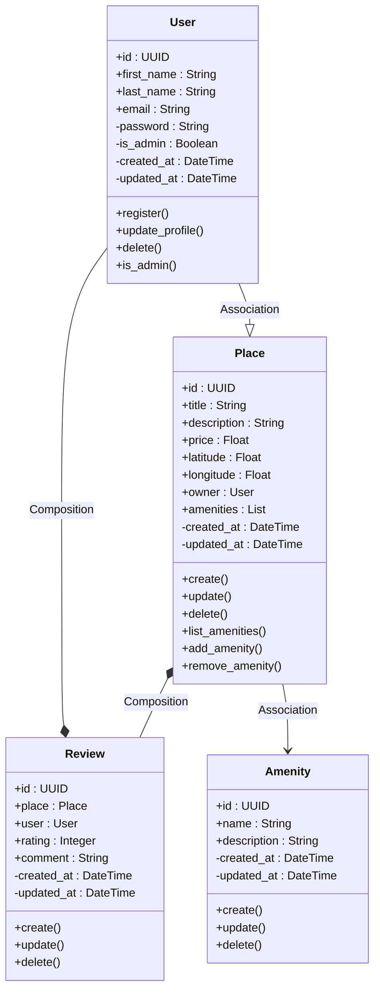

## Class Diagram

```mermaid
classDiagram
class User {
    +id : UUID
    +first_name : String
    +last_name : String
    +email : String
    -password : String
    -is_admin : Boolean
    -created_at : DateTime
    -updated_at : DateTime
    +register()
    +update_profile()
    +delete()
    +is_admin()
}
class Place {
    +id : UUID
    +title : String
    +description : String
    +price : Float
    +latitude : Float
    +longitude : Float
    +owner : User
    +amenities : List
    -created_at : DateTime
    -updated_at : DateTime
    +create()
    +update()
    +delete()
    +list_amenities()
    +add_amenity()
    +remove_amenity()
}
class Review {
    +id : UUID
    +place : Place
    +user : User
    +rating : Integer
    +comment : String
    -created_at : DateTime
    -updated_at : DateTime
    +create()
    +update()
    +delete()
}
class Amenity {
    +id : UUID
    +name : String
    +description : String
    -created_at : DateTime
    -updated_at : DateTime
    +create()
    +update()
    +delete()
}
User --|> Place : Association
Place *-- Review : Composition
Review *-- User : Composition
Place --> Amenity : Association
```
