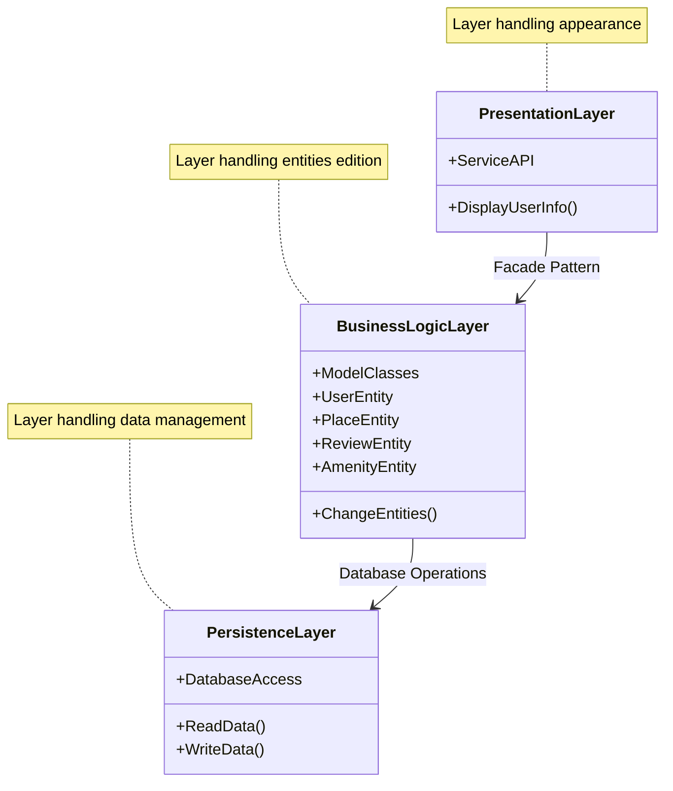

## Package Diagram

```mermaid
classDiagram
class PresentationLayer {
    +ServiceAPI
    +DisplayUserInfo()

}
class BusinessLogicLayer {
    +ModelClasses
    +UserEntity
    +PlaceEntity
    +ReviewEntity
    +AmenityEntity
    +ChangeEntities()
}
class PersistenceLayer {
    +DatabaseAccess
    +ReadData()
    +WriteData()
}
note for PresentationLayer "Layer handling appearance"
        note for BusinessLogicLayer "Layer handling entities edition"
        note for PersistenceLayer "Layer handling data management"
PresentationLayer --> BusinessLogicLayer : Facade Pattern
BusinessLogicLayer --> PersistenceLayer : Database Operations
```
